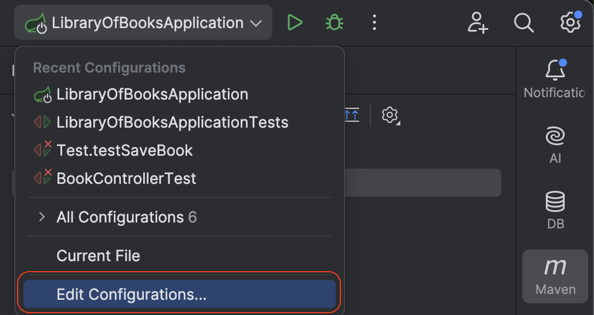
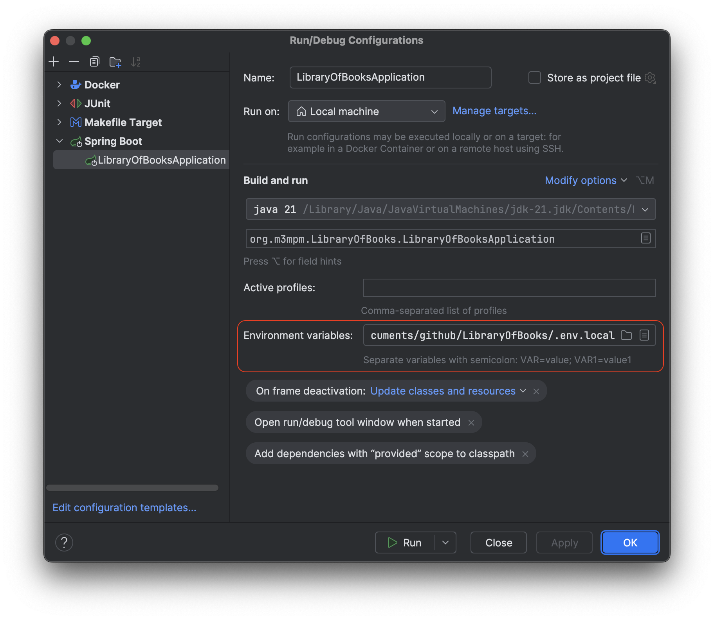
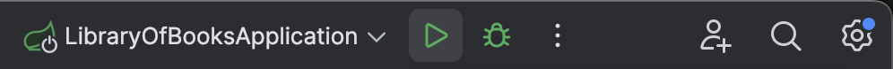

## Задание

### Задача 1: Создание простого API для управления библиотекой книг.

Создайте RESTful API на Spring Boot для управления библиотекой книг. API должен поддерживать следующие операции:
1. Получение списка всех книг.
2. Получение книги по идентификатору.
3. Добавление новой книги.
4. Обновление информации о книге.
5. Удаление книги по идентификатору.

Каждая книга должна иметь следующие поля: id, title, author, publishedDate.

## 🚀Запуск приложения

### Требования к ПО для запуска проекта:

- Версия java: `Open JDK 21.0.7`
- Система сборки: `Apache Maven 3.9.9 `
- Wrapper: `maven-wrapper-3.3.2`

### Первый способ: запуск через IntelliJ IDEA на локальном ПК

> Примечание: Для запуска приложения через IntelliJ IDEA Вам потребуется отдельно запустить приложение `PostgreSQL` и 
> создать БД с названием `books_db`. Либо можете использовать свою БД в `PostgreSQL`, тогда внесите изменения в файл
> `src/main/resources/application.properties` в строку `spring.datasource.url=jdbc:postgresql://localhost:5432/books_db`
> вместо `books_db` укажите название вашей БД.

Далее выполните следующие шаги:

1. Открыть клонированный репозиторий, как проект при помощи IntelliJ IDEA
2. Открыть файл pom.xml
3. В верхней части редактора pom.xml появится всплывающее окно с предложением импортировать проект с помощью Maven. 
Если всплывающее окно не появилось, вы можете щелкнуть правой кнопкой мыши на файле pom.xml и выбрать "Maven" -> "Reload project".
IntelliJ IDEA начнет загружать и подгружать все зависимости, указанные в файле pom.xml.
4. Создать в корневом каталоге `LibraryOfBooks/` **.env.local** файл с переменными окружения

   ### Enviromant variable
   #### Example .env.local файла:
   ```
   # Spring DB connection settings
   SPRING_DATASOURCE_URL_LOCAL=jdbc:postgresql://localhost:5432/books_db
   SPRING_DATASOURCE_USERNAME_LOCAL=your_user_name
   SPRING_DATASOURCE_PASSWORD_LOCAL=your_password
   ```
   
5. Добавить файл с переменными окружения (например, файл .env.local или .env) в проект через графический интерфейс

   - В настройках конфигурации запуска есть поле «Environment variables», где вести путь к файлу или использовать кнопку «Browse for .env files and scripts» в поле. В случае нескольких файлов — разделить их запятыми (;)

   

      

6. Запустите проект через кнопку запуска проекта в верхнем правом углу IntelliJ IDEA

   

### Второй способ: запуск приложения в Docker

Для запуска приложения в Docker выполните следующие шаги:

1. Запустите Docker
2. Создать в корневом каталоге `LibraryOfBooks/` **.env.docker** файл с переменными окружения

   ### Enviromant variable
   #### Example .env.docker файла:
   ```
   # PostgreSQL settings
   POSTGRES_DB=docker_books_db
   POSTGRES_USER=your_user
   POSTGRES_PASSWORD=your_password
   
   # Spring profile
   SPRING_PROFILES_ACTIVE=docker
   
   # Spring DB connection settings
   SPRING_DATASOURCE_URL=jdbc:postgresql://db:5432/docker_books_db
   SPRING_DATASOURCE_USERNAME=your_user
   SPRING_DATASOURCE_PASSWORD=your_password
   ```
   
3. Перейдите в корневой каталог проекта `LibraryOfBooks/`, где находится файл `docker-compose.yml` и файл `Makefile`
4. Для сборки образов и запуска контейнера из файла `docker-compose.yml` выполните следующую команду в терминале:

   ```bash
   make docker-build-up
   ```
   
   В целом, эта команда собирает Docker-образы (если они изменились) и затем запускает контейнеры, определенные в файле `docker-compose.yml`. Это комбинация команд `docker-build` и `docker-up`

5. Для отдельной сборки образов из файла `docker-compose.yml` выполните следующую команду:

   ```bash
   make docker-build
   ```
   
6. Для отдельного запуска контейнеров выполните следующую команду в терминале:

   ```bash
   make docker-up
   ```

### Остановка приложения в Docker

1. Для остановки и удаления контейнеров выполните следующую команду:

   ```bash
   make docker-down
   ```
   
2. Для остановки и удаления контейнера, а затем удаления всех неиспользуемых Docker-ресурсов (образы, контейнеры, сети, тома) для освобождения места на диске используйте следующию команду:

   ```bash
   make docker-clean
   ```

Это более агрессивная очистка, чем `docker-down`

### Для проверки приложения используйте программу `Postman`

#### Запуск через IntelliJ IDEA на локальном ПК

1. Получение списка всех книг: `GET http://localhost:8080/books`
2. Получение книги по идентификатору: `GET http://localhost:8080/books/id`, где id - номер книги
3. Добавление новой книги: `POST http://localhost:8080/books/add`. В тело запроса поместите данные в формате JSON:

   ```
   {
    "title": "IvanovLine компания - как философия жизни",
    "author": "Иван Иванов",
    "publishedDate": "2023-10-10"
   }
   ```
   
4. Обновление информации о книге: `PUT http://localhost:8080/books/edit/id`, где id - номер книги. В тело запроса поместите данные в формате JSON:

   ```
   {
    "title": "IvanovLine Company Co.",
    "author": "Ivan Ivanov",
    "publishedDate": "2002-01-10"
   }
   ```
   
5. Удаление книги по идентификатору: `DEL http://localhost:8080/books/delete/id`, где id - номер книги

#### Запуск приложения в Docker

1. Получение списка всех книг: `GET http://localhost:/books`
2. Получение книги по идентификатору: `GET http://localhost:/books/id`, где id - номер книги
3. Добавление новой книги: `POST http://localhost:/books/add`. В тело запроса поместите данные в формате JSON:

   ```
   {
    "title": "IvanovLine компания - как философия жизни",
    "author": "Иван Иванов",
    "publishedDate": "2023-10-10"
   }
   ```

4. Обновление информации о книге: `PUT http://localhost:/books/edit/id`, где id - номер книги. В тело запроса поместите данные в формате JSON:

   ```
   {
    "title": "IvanovLine Company Co.",
    "author": "Ivan Ivanov",
    "publishedDate": "2002-01-10"
   }
   ```

5. Удаление книги по идентификатору: `DEL http://localhost:/books/delete/id`, где id - номер книги
 